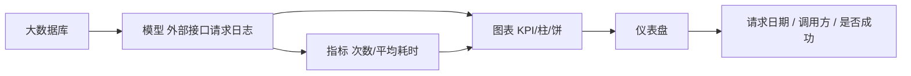
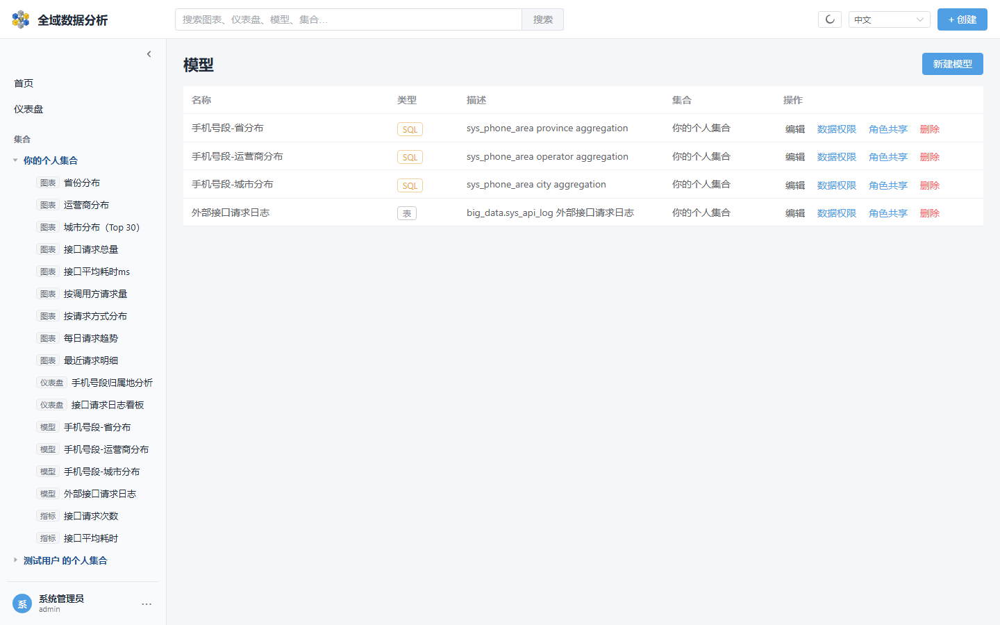
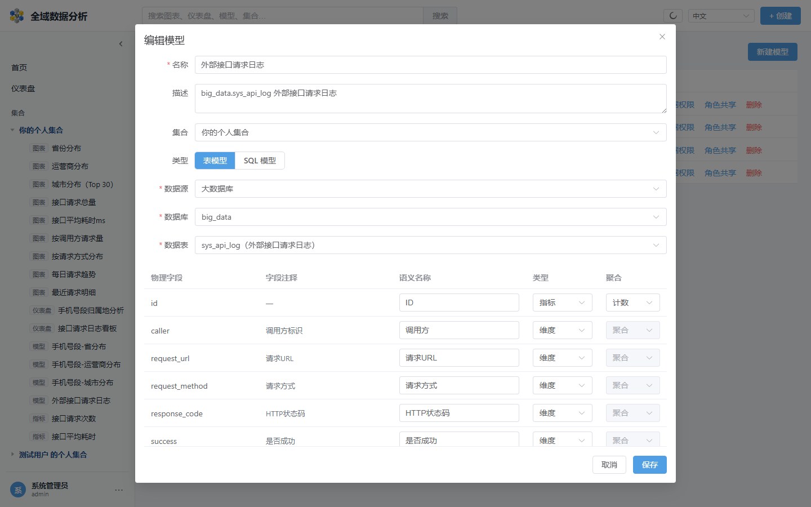
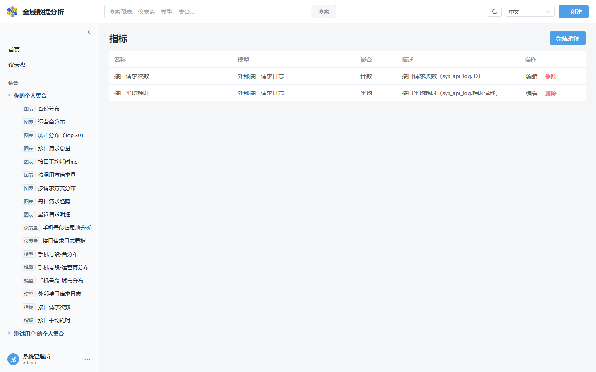
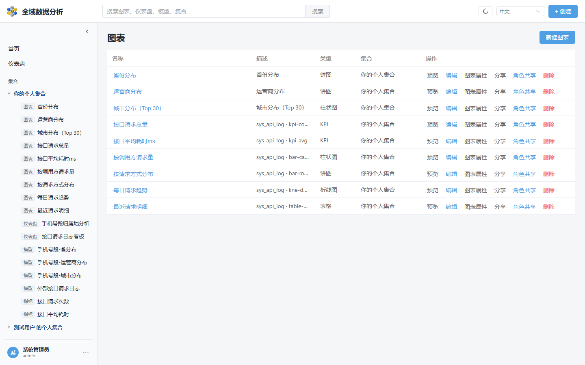
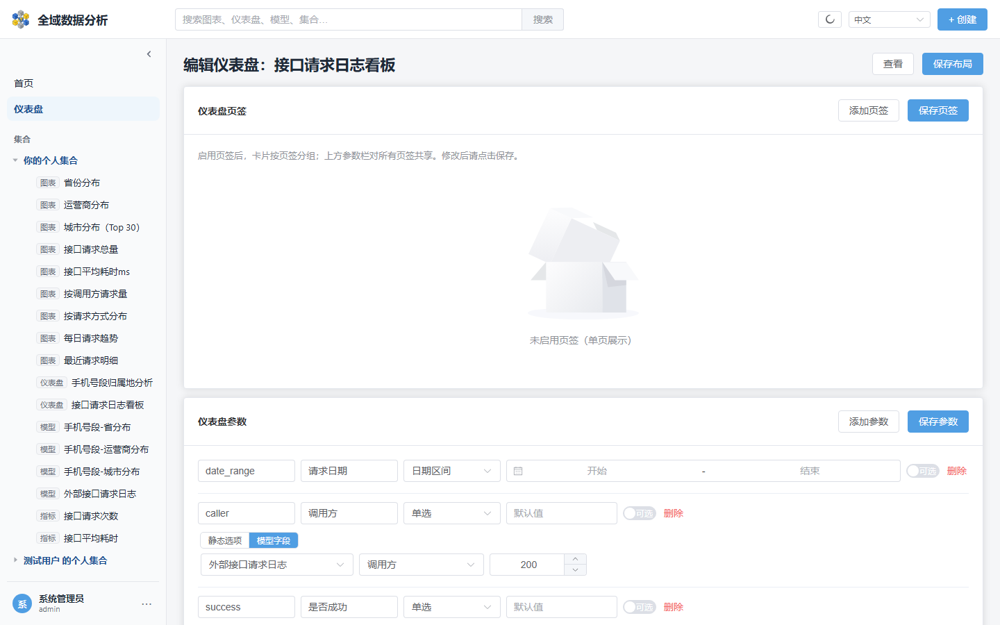
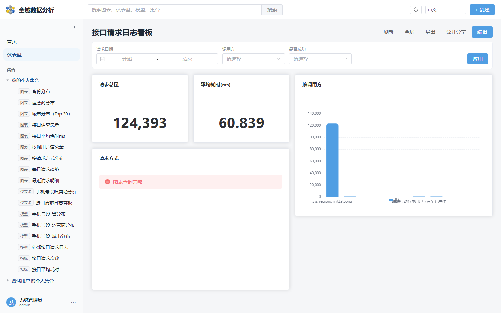
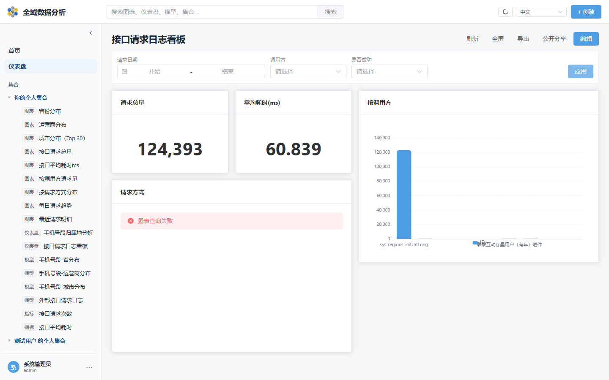

# 实战：用 `sys_api_log` 搭「接口请求日志看板」

本文基于本地环境 **大数据库**（`big_data.sys_api_log`）完成：**模型 → 指标 → 图表 → 仪表盘参数（含日期筛选）**。截图来自 `http://localhost:5173/`。

**打开看板：** [接口请求日志看板](http://localhost:5173/dashboards/5/view)  
**编辑参数：** [编辑页](http://localhost:5173/dashboards/5/edit)



---

## 1. 数据源

管理后台已配置 **大数据库**：

| 项 | 值 |
|----|-----|
| 名称 | 大数据库 |
| 库 | `big_data` |
| 表 | `sys_api_log` |
| 方言 | MySQL |

建看板前请先 **同步元数据**，否则模型选不到表。

---

## 2. 创建模型

路径：侧栏 **数据 → 模型** → **新建模型**（或顶栏 **+ 创建 → 模型**）。

本例模型名：**外部接口请求日志**（表模型）。



字段语义（节选）：

| 语义名 | 物理列 | 类型 | 聚合 |
|--------|--------|------|------|
| ID | `id` | 指标 | 计数 |
| 调用方 | `caller` | 维度 | — |
| 请求方式 | `request_method` | 维度 | — |
| 是否成功 | `success` | 维度 | — |
| 耗时毫秒 | `cost_time` | 指标 | 平均 |
| 创建时间 | `create_time` | 维度 | — |
| 请求URL | `request_url` | 维度 | — |
| HTTP状态码 | `response_code` | 维度 | — |



---

## 3. 创建指标

路径：侧栏 **数据 → 指标** → **新建指标**。

| 名称 | 模型 | 引用字段 | 聚合 |
|------|------|----------|------|
| 接口请求次数 | 外部接口请求日志 | ID | 计数 |
| 接口平均耗时 | 外部接口请求日志 | 耗时毫秒 | 平均 |



---

## 4. 创建图表

路径：**+ 创建 → 图表** 进入查询工作台，或图表列表 **新建图表**。

本例已保存的图表：

| 图表 | 类型 | 说明 |
|------|------|------|
| 接口请求总量 | KPI | 计数 ID |
| 接口平均耗时ms | KPI | 平均 cost_time |
| 按调用方请求量 | 柱状 | 维度=调用方 |
| 按请求方式分布 | 饼图 | 维度=请求方式 |
| 每日请求趋势 | 折线 | SQL：按日聚合（可用开始/结束日期参数） |
| 最近请求明细 | 表格 | SQL：明细列表 |



---

## 5. 仪表盘与参数绑定

### 5.1 新建仪表盘并加卡片

路径：**仪表盘 → 新建仪表盘** → 添加上述图表 → **保存布局**。

看板名：**接口请求日志看板**。

### 5.2 定义参数（日期搜索等）

编辑页 **仪表盘参数** → **添加参数** → **保存参数**：

| ID | 标签 | 类型 | 说明 |
|----|------|------|------|
| `date_range` | 请求日期 | 日期区间 | 语义绑定到「创建时间」（自动拆成 ≥ / ≤） |
| `caller` | 调用方 | 单选 | 选项来自模型字段 DISTINCT「调用方」 |
| `success` | 是否成功 | 单选 | 静态：成功=1 / 失败=0 |




### 5.3 卡片绑定

选中卡片 → **参数绑定** → **保存卡片配置**：

| 参数 | 模式 | 字段 |
|------|------|------|
| 请求日期 | 语义 | 创建时间 |
| 调用方 | 语义 · EQ | 调用方 |
| 是否成功 | 语义 · EQ | 是否成功 |

「按调用方」卡片另开了 **点击联动**：点击柱子写入「调用方」参数（替换）。

---

## 6. 查看与筛选

打开查看页，参数栏会出现日期区间与下拉；改完点 **应用**。



当前看板实测：

- **请求总量**：124,393（与表自增水位一致）
- **平均耗时(ms)**：约 60.8
- **请求方式**：GET 占绝大多数，POST 少量
- **请求日期 / 调用方 / 是否成功**：用于过滤语义卡片



---

## 7. 你怎么自己复现

1. 确认 **大数据库** 可连且已 **同步元数据**。  
2. **模型**：表模型选 `big_data` / `sys_api_log`，按上表配置字段。  
3. **指标**：请求次数（COUNT）、平均耗时（AVG）。  
4. **图表**：至少做 2 个 KPI + 1 个维度分布图。  
5. **仪表盘**：加卡片 → 参数 `date_range`（日期区间）绑「创建时间」→ 查看页选日期 → **应用**。

自动化脚本（可选）：

```bash
cd web
node scripts/setup-api-log-dashboard.mjs
# 截图
set PLAYWRIGHT_SKIP_WEBSERVER=1
set E2E_USERNAME=admin
set E2E_PASSWORD=admin123
npx playwright test tests/capture-api-log-guide.spec.ts
```

截图输出目录：`docs/assets/user-guide/`。

---

## 8. 注意

- 雪花 ID 在脚本里必须用**字符串**，不要 `Number(id)`（会丢精度）。  
- `date-range` 只能走**语义绑定**；SQL 图表请拆成两个 `date` 参数绑两个 `?`。  
- 仪表盘多卡并行查远程库时，偶发「图表查询失败」，点 **刷新** 或减少同时展示的卡片即可。  
- 明细类查询不要把「指标」字段当维度塞进可视化表格（会报「字段语义类型不匹配」），明细用 SQL 图表更合适。

---

## 9. 相关文档

- 通用操作步骤：[user-guide.md](user-guide.md)
- 签名嵌入（业务系统 iframe + 锁定参数）：[embed-integration.md](embed-integration.md)
- 产品总览：[README.md](../README.md)
- 应用内帮助：侧栏 **帮助**（`/help`），本页对应「接口日志实战」标签
