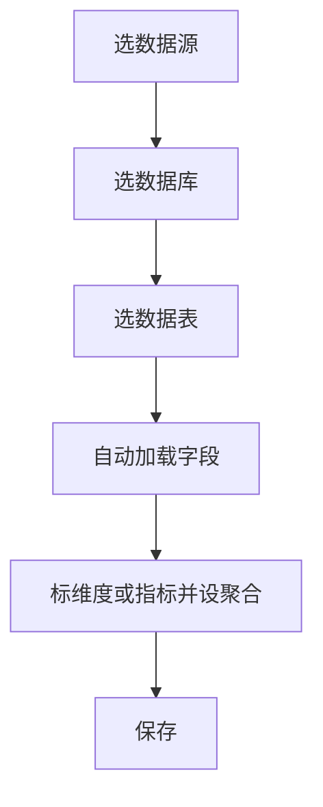
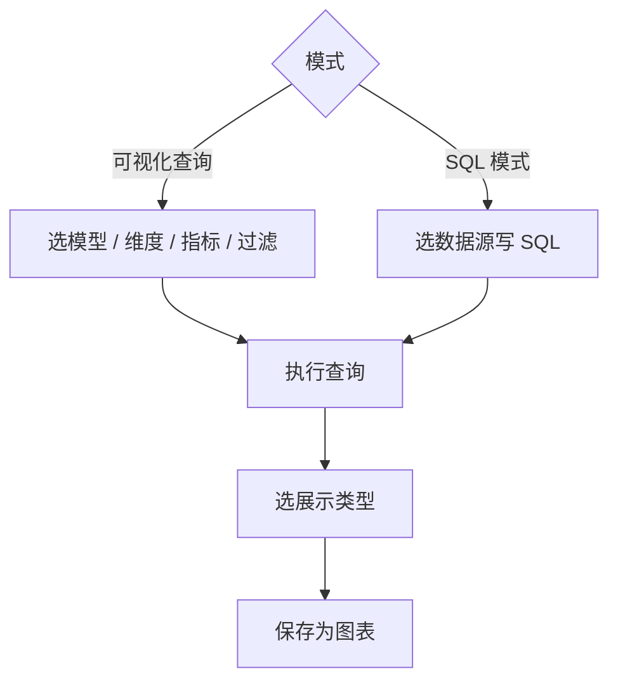
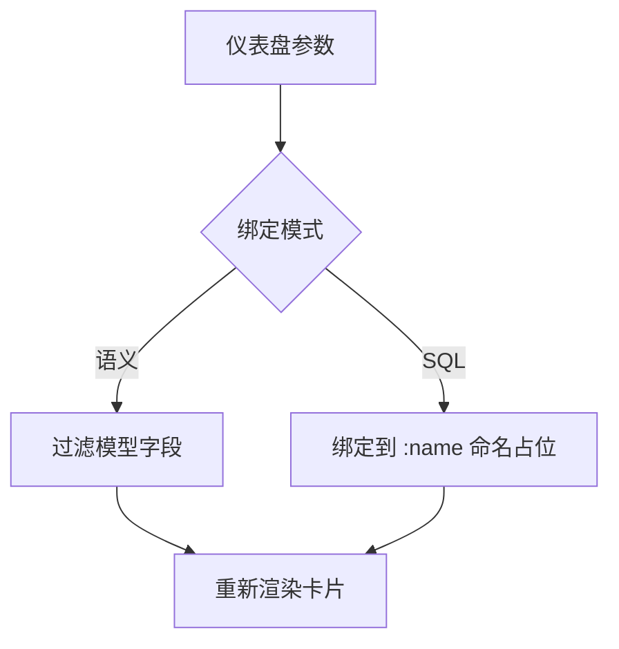

# Omni Data Panel 使用手册

> **关于截图**：通用步骤见下文；基于 `big_data.sys_api_log` 的实战截图与看板说明见 **[api-log-dashboard-guide.md](api-log-dashboard-guide.md)**（含日期筛选）。

推荐创建顺序：

---

## 1. 写在前面

本产品为**单租户自建**：一个部署实例服务一个组织。角色与 ACL 用于组织内授权，**不是**多客户共享集群的多租户模型；需要隔离请分别部署。

| 界面说法 | 含义 |
|----------|------|
| 模型 | 基于物理表或 SQL 的语义数据集 |
| 指标 | 挂在模型字段上的业务度量（聚合） |
| 图表 | 一次可复用的可视化查询结果 |
| 仪表盘 | 多图表布局 + 参数联动 |
| 集合 | 内容文件夹（个人集合不可共享） |

常见权限：

| 你要做的事 | 需要的能力 |
|------------|------------|
| 打开查询工作台 | `query:execute` |
| 保存图表 | `chart:create` |
| 新建模型 / 指标 | `dataset:create` |
| 新建仪表盘 | `dashboard:create` |
| 原生 SQL | `query:raw` |
| 维护数据源连接 | 管理员 |

---

## 2. 准备数据源（管理员）

没有可用数据源时，模型与 SQL 都无从谈起。

1. 进入 **管理后台 → 数据源**（`/admin/databases`）。
2. 点 **新增数据源**，填写：
   - **名称**
   - **数据库类型**（MySQL、PostgreSQL、ClickHouse、Hive、Spark…）
   - **主机 / 端口 / 库名 / 用户名 / 密码**
3. **测试** 连通性 → 保存。
4. 点 **同步元数据**（表模型依赖这一步加载库表字段）。
5. **角色授权**，让业务角色至少有该数据源的 **READ**。

普通用户侧栏 **数据 → 数据源** 只能浏览库表，不能改连接。

---

## 3. 创建模型

入口任选其一：

- 侧栏 **数据 → 模型** → **新建模型**
- 顶栏 **+ 创建 → 模型**（可先选所属集合）

对话框标题：**新建模型** / **编辑模型**。

### 3.1 公共字段

| 标签 | 说明 |
|------|------|
| 名称 | 必填 |
| 描述 | 可选 |
| 集合 | 归属集合 |
| 类型 | **表模型** 或 **SQL 模型** |
| 数据源 | 必填 |

### 3.2 表模型

适合「一张业务表 / 视图 → 语义字段」。

步骤：

1. 类型选 **表模型**。
2. 依次选择 **数据源 → 数据库 → 数据表**（字段会自动加载）。
3. 在字段表中配置：
   - **语义名称**（展示名）
   - **类型**：维度 / 指标
   - **聚合**（仅指标：求和 / 平均 / 计数 / 最大 / 最小）
4. 保存。

注意：

- 元数据未同步时，库表下拉为空。
- 切换「表模型 ↔ SQL 模型」会重置部分配置，勿误点。

### 3.3 SQL 模型

适合「多表关联 / 自定义 SELECT」。

1. 类型选 **SQL 模型**。
2. 选择 **数据源**。
3. 在 **定义 SQL** 中写**单条**只读 `SELECT` / `WITH`（系统会将其作为子查询封装）。
4. 用 **根据 SQL 生成** 推断输出字段，或手动 **添加字段**。
5. 输出字段的 **列名（SQL 别名）** 必须与结果列一致；再设语义名称、类型、聚合。
6. 保存。

可点 **格式化** 整理 SQL；侧栏元数据可辅助插入表名。

---

## 4. 创建指标（可选）

指标是「可复用的业务度量」，在查询工作台的 **业务指标** 里选用。

入口：侧栏 **数据 → 指标** → **新建指标**。

| 标签 | 规则 |
|------|------|
| 名称 | 必填 |
| 描述 | 可选 |
| 模型 | 必填（必须先有模型） |
| 引用字段 | 必填，来自该模型字段 |
| 聚合 | 必填（默认求和） |
| 集合 | 可选 |

注意：

- 先保存模型（含字段），再建指标。
- 更换模型后，原引用字段若不存在会被清空。
- 工作台里只会列出**当前所选模型**下的指标。

---

## 5. 创建图表

界面统一叫 **图表**（路由仍是 `/questions`）。

### 5.1 入口

| 入口 | 行为 |
|------|------|
| 顶栏 **+ 创建 → 图表** | 选集合后进入查询工作台 |
| 首页 / 列表 **新建图表** | 进入 `/query` |
| 侧栏 **SQL 查询** | 写 SQL 后可 **保存到集合** |

### 5.2 查询工作台（推荐）

页标题：**查询工作台**（编辑已有图表时为 **编辑图表**）。

**可视化查询：**

1. 选择 **模型**。
2. 勾选 **维度**、**模型字段指标**，以及可选的 **业务指标**。
3. 配置 **过滤条件**、**排序**、**返回行数**。
4. 点 **执行查询**（必须先成功执行才能保存）。
5. 选择 **展示类型**（表格、柱状、折线、面积、组合、饼图、散点、KPI、漏斗、地图等）。
6. 填写名称 / 描述 / 集合 → **保存为图表**。

**SQL 模式**（需 `query:raw`）：选数据源、写 SQL（推荐 `:channel_id` 命名占位，也兼容 `?`）→ 填参数 → 执行 → 保存。

### 5.3 SQL 查询页另径

侧栏 **数据 → SQL 查询**：可直接 **保存到集合**，**不强制先执行**（与工作台不同）。

---

## 6. 创建仪表盘并排版

入口：

- **仪表盘** 页 → **新建仪表盘**
- 或 **+ 创建 → 仪表盘**

创建后进入 **编辑仪表盘**（`/dashboards/:id/edit`）。

### 6.1 添加图表与布局

1. 在工具条 **选择图表** → **添加图表**（同一图表不能重复添加）。
2. 在画布上拖拽调整位置与大小。
3. 点 **保存布局**。
4. 需要分页时，使用 **仪表盘页签**：添加 / 保存页签（参数栏跨页签共享）。

右侧选中卡片后，可设 **所属页签**、参数绑定、点击联动，最后点 **保存卡片配置**。

---

## 7. 仪表盘参数与绑定（核心）

编辑页自上而下大致为：

1. 标题与 **查看** / **保存布局**
2. **仪表盘页签**
3. **仪表盘参数**
4. 画布 + 右侧 **卡片配置**

请分清三个保存按钮：

| 按钮 | 保存内容 |
|------|----------|
| **保存布局** | 卡片位置与尺寸 |
| **保存参数** | 参数定义与页签 |
| **保存卡片配置** | 参数绑定、点击联动、所属页签 |

### 7.1 定义参数

1. 在 **仪表盘参数** 区点 **添加参数**。
2. 配置：

| 字段 | 说明 |
|------|------|
| ID | 配置键，绑定靠它，改动需同步绑定 |
| 标签 | 查看页参数栏上的显示名 |
| 类型 | 文本 / 数字 / 日期 / 日期区间 / 单选 / 多选 |
| 默认值 | 日期区间为开始–结束 |
| 必填 / 可选 | 是否强制填写 |

3. 点 **保存参数**。

查看页：改完参数后点 **应用**，卡片才会按新值重刷。

### 7.2 单选 / 多选的选项来源

切换 **静态选项** | **模型字段**：

- **静态选项**：每行一个；可用 `标签=值`。
- **模型字段**：选模型 + 字段 + limit（默认 200）  
  运行时对该字段做 `SELECT DISTINCT`（界面不出现 DISTINCT 字样）。  
  字段名使用模型的 **语义名称**。

### 7.3 参数绑定到卡片

选中画布上的卡片 → **参数绑定** → **添加绑定**：

| 模式 | 适用 | 配置 |
|------|------|------|
| **语义** | 可视化图表 | 参数 + 字段 + 运算符（EQ/NE/GT/…/IN） |
| **SQL** | 带 `:name` 或 `?` 的 SQL 图表 | 优先填 **参数名**（对应 `:channel_id`）；旧配置仍可用 `parameterIndex` |

配置完点 **保存卡片配置**。

示例思路：

- 参数 `region`（单选，选项来自「订单模型.区域」）  
- 绑定到销售趋势图：语义 → 字段「区域」→ EQ  
- 查看页选「华东」→ **应用** → 该卡只显示华东数据

### 7.4 点击联动

在 **卡片配置 · 点击联动**：

| 标签 | 含义 |
|------|------|
| 启用 | 开关 |
| 写入参数 | 点击系列/类目后写入哪个参数 |
| 写入方式 | **替换** 或 **切换多选** |

典型用法：柱状图点击某类目 → 写入「品类」参数 → 其它绑了该参数的卡片一起刷新。

记得 **保存卡片配置**，再到 **查看** 页验证。

---

## 8. 一条最短实操路径

1. 管理员：**数据源** → 新增 → **同步元数据** → **角色授权**  
2. **模型** → 表模型选库表，把金额标成指标、日期/类目标成维度 → 保存  
3. （可选）**指标** → 选模型字段「金额」+ 求和 → 保存  
4. **+ 创建 → 图表** → 工作台选模型，维度+指标，执行 → **保存为图表**  
5. **仪表盘** → 新建 → **添加图表** → **保存布局**  
6. **添加参数**（如区域单选，选项用模型字段）→ **保存参数**  
7. 选中卡片 → **参数绑定**（语义过滤区域）→ **保存卡片配置**  
8. **查看** → 改参数 → **应用**

---

## 9. 登录、MFA 与企业 SSO

| 方式 | 说明 |
|------|------|
| 本地密码 | 登录页输入账号密码；客户端先请求登录挑战再 HMAC 签名提交 |
| TOTP 双因素 | 用户可在个人设置启用；启用后密码通过后还需动态码 / 备份码 |
| 企业 SSO | 管理员配置 `OIDC_*` 后，登录页出现企业登录按钮；详见 [oidc-sso.md](oidc-sso.md) |

注意：SSO 成功后**不再**要求应用内 TOTP（双因素应在 IdP 侧强制）。并发会话上限见管理端设置 `auth.session.max-concurrent`。

---

## 10. 管理端：设置、订阅与调度

需管理员或具备对应权限（如 `schedule:manage`）。

### 10.1 通用设置（`/admin/settings`）

| 项 | 说明 |
|----|------|
| 站点名称 | 登录页、标题栏展示名 |
| 允许嵌入 | `embed.enabled`；关闭后无法签发/解析嵌入令牌 |
| 嵌入域名白名单 | `embed.allowed-origins`；每行一个 Origin（如 `https://app.example.com`）。**空则仅允许同源嵌套**。Compose 须同步 `EMBED_ALLOWED_ORIGINS`（空格分隔）并重启 web |
| 查询缓存 | 站点级开关与 TTL |
| 同时登录设备数 | `auth.session.max-concurrent`；`0` 表示不限制 |
| 邮件 SMTP | 订阅与系统邮件依赖；可测试发送 |

可信代理 `TRUSTED_PROXIES` **不在管理端配置**，写在部署环境变量中（见 [production.md](production.md)）：仅当直连 IP 属于可信 CIDR 时才采信 `X-Forwarded-For`。

### 10.2 订阅（`/admin/subscriptions`）

按 Cron 向站内用户邮箱推送仪表盘（可选 PDF）。需配置 SMTP。可启停、编辑收件人、立即发送。

### 10.3 调度（`/admin/schedules`）

通用 Quartz 任务（与订阅并列，需 `schedule:manage`）：

| 类型 | 目标 | 作用 |
|------|------|------|
| 元数据同步 | 数据源 | 定时同步库表元数据 |
| 仪表盘刷新 | 仪表盘 | 后台安全渲染刷新 |
| 订阅发送 | 已有订阅 | 按订阅配置发送（收件人仍在「订阅」页维护） |

JobStore 为 JDBC 集群；多实例共享触发器。

---

## 11. 分享与嵌入

| 能力 | 入口 | 要点 |
|------|------|------|
| 公开链接 | 仪表盘 / 图表分享 | 可撤销；适合对外只读；不过期直至删除 |
| 签名嵌入 | 业务系统服务端代签 | 短期 JWT（约 1h）；开启「允许嵌入」并配置域名白名单；见 [embed-integration.md](embed-integration.md) |
| 邮件订阅 | 管理后台 → 系统 → 订阅 | 见 §10.2 |
| 通用调度 | 管理后台 → 系统 → 调度 | 见 §10.3 |

嵌入与公开视图使用参数**默认值**，访客不能像登录态查看页那样改参重刷。

---

## 12. 常见问题

| 现象 | 可能原因 |
|------|----------|
| 建模型时库表为空 | 未同步元数据，或无数据源 READ |
| 工作台不能保存图表 | 未先执行成功，或无 `chart:create` |
| 业务指标列表为空 | 未建指标，或指标不属于当前模型 |
| 参数改了卡片没变 | 查看页未点 **应用**；或未保存绑定 |
| 绑定无效 | 参数未先保存；参数 ID 被改过；语义字段名不对 |
| 动态选项为空 | 模型无 READ；字段被列权限排除；语义名写错 |
| 无法编辑仪表盘 | 访问级别不是 ADMIN / OWNER / WRITE |
| 登录页无企业按钮 | 未启用 OIDC 或 issuer/client 配置不全 |
| 嵌入 iframe 空白 | 未开 `embed.enabled`、白名单未含父页面 Origin / 未同步 `EMBED_ALLOWED_ORIGINS`、令牌过期、或混合内容（HTTPS 嵌 HTTP） |
| 接口返回 429 | 触发登录 / 公开 / 嵌入 IP 限流；多副本下配额在 Redis 合计 |
| 限流误伤全站 | 未配 `TRUSTED_PROXIES`，所有人共用代理 IP 一个桶；或白名单过宽导致伪造 XFF |
| 调度不执行 | 任务未启用、Cron 非法、目标资源无权，或 Quartz JDBC 未就绪 |

---

## 13. 相关文档

| 文档 | 内容 |
|------|------|
| [README.md](../README.md) | 产品总览、部署、API 索引 |
| [production.md](production.md) | 生产密钥、探针、可信代理、加固清单 |
| [oidc-sso.md](oidc-sso.md) | 企业 OIDC 对接 |
| [embed-integration.md](embed-integration.md) | 业务系统签名嵌入 |
| [observability.md](observability.md) | Prometheus、requestId、告警 |
| [api-log-dashboard-guide.md](api-log-dashboard-guide.md) | `sys_api_log` 实战截图 |

应用内也可打开侧栏 **帮助**（`/help`）阅读上述文档的渲染版（与仓库 `docs/` 同源）。

---

如需**实机截图版**：请启动前端（如 `http://localhost:5173`）与后端，告知地址与可用账号；可用 Playwright 按本章步骤自动截图并回填到本文对应章节。
